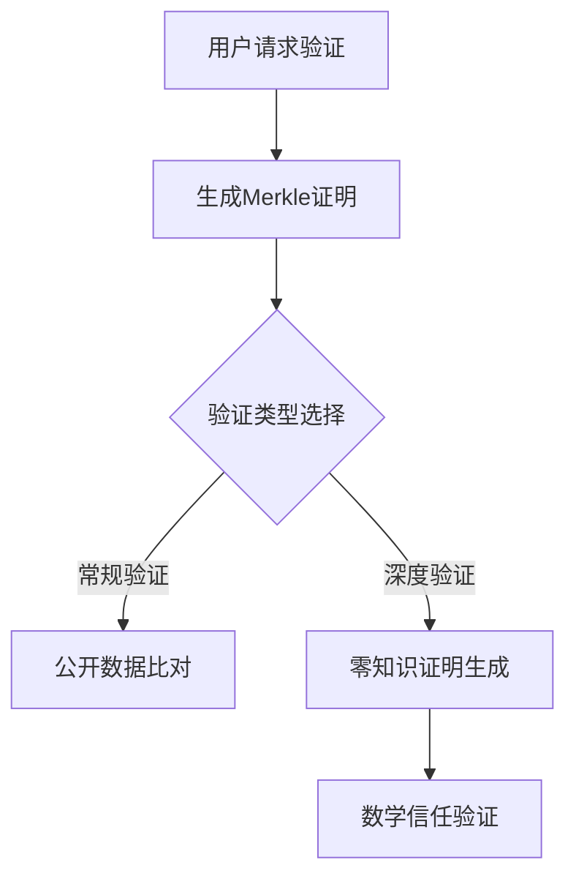

# Coinbase探索储备证明新方案并启动开发者资助计划

## 链上会计的行业变革机遇
Coinbase宣布将深化链上会计技术应用，同时推出500万美元开发者资助计划，推动加密行业透明度建设。该计划旨在通过技术创新，建立可验证的资产储备证明体系，重构用户信任机制。

👉 [了解如何提升加密资产透明度](https://bit.ly/okx_welcome)

## 储备证明体系的必要性

### 传统审计与加密行业的碰撞
在FTX事件引发的行业信任危机中，超过74%的交易所未能提供有效资产证明。Coinbase作为上市公司，采用双重验证机制：
1. 传统财务审计：SEC备案+四大会计事务所季度审查
2. 技术验证：冷钱包地址随机抽样验证，要求资金移动证明

2023年Q2财报显示，Coinbase已将数字资产纳入资产负债表负债端，这一做法符合SAB 121会计准则要求。

### 技术演进路线图
| 验证阶段 | 技术方案 | 验证效率 | 隐私保护 |
|---------|---------|---------|---------|
| 初期验证 | 地址抽样验证 | 人工操作 | 低 |
| 当前阶段 | Merkle树验证 | 自动化处理 | 中等 |
| 未来规划 | 零知识证明 | 实时验证 | 高 |

## 行业实践案例对比

### Binance储备证明系统解析
Binance最新推出的BTC储备证明系统实现：
- 101%储备率透明展示
- 用户级余额验证：通过Merkle树根哈希校验
- 提供Python验证脚本（代码量约200行）
- 多钱包地址合并验证（涵盖现货/保证金/期货账户）

### 技术挑战与解决方案
常见问题：
- **实时性矛盾**：链上数据更新延迟 vs 用户即时验证需求
- **隐私悖论**：透明度提升可能暴露商业机密
- **成本控制**：零知识证明的计算资源消耗

Coinbase技术方案：

## 开发者资助计划详解

👉 [获取区块链技术开发支持](https://bit.ly/okx_welcome)

### 资助重点领域
1. **零知识储备证明**（ZK-PoRL）
   - 目标：实现TB级数据的秒级验证
   - 现状：当前验证耗时约15分钟
2. **隐私保护算法**
   - 研究方向：选择性披露机制
   - 应用场景：机构用户资产隔离验证
3. **自动化审计框架**
   - 开发需求：智能合约级风险检测

### 申请指南
- 资助梯度：
  - 种子项目：$25,000
  - 成长项目：$100,000
  - 旗舰项目：$250,000
- 评审标准：
  - 技术创新性（40%）
  - 落地可行性（30%）
  - 团队技术实力（30%）

## FAQ

### Q：零知识证明如何保障数据隐私？
A：通过数学证明替代原始数据展示，验证者可在不接触具体数据的情况下确认资产真实性，类似"证明你知道保险箱密码但无需实际输入"。

### Q：普通用户如何验证交易所储备？
A：三步验证流程：
1. 获取交易所发布的Merkle根
2. 输入个人账户地址生成验证路径
3. 比对链上数据与证明结果

### Q：资助计划的知识产权归属？
A：Coinbase采用"创新共享"模式，核心技术专利开放授权，但要求获得资助的项目需承诺一定期限的技术开放。

## 技术演进时间表

| 里程碑 | 关键成果 | 影响预测 |
|-------|---------|---------|
| 2023Q4 | 零知识证明测试网 | 验证效率提升至30秒内 |
| 2024Q2 | 隐私保护验证模块 | 机构用户参与度提升50% |
| 2025Q1 | 自动化审计平台 | 行业审计成本降低70% |

👉 [探索区块链技术前沿](https://bit.ly/okx_welcome)

## 未来展望
Coinbase首席技术官表示："我们正在构建的不仅是验证系统，更是加密经济的信任基础设施。目标是在2025年前实现：1）实时验证能力；2）跨链储备证明；3）智能合约化审计。"

行业分析师指出，当前储备证明技术仍面临三大挑战：
1. **标准化缺失**：不同交易所采用不同验证方案
2. **用户体验门槛**：技术验证过程复杂度较高
3. **跨链互操作性**：多链资产验证效率低下

Coinbase的500万美元资助计划，或将加速解决这些行业痛点，推动加密经济向合规化、透明化方向演进。