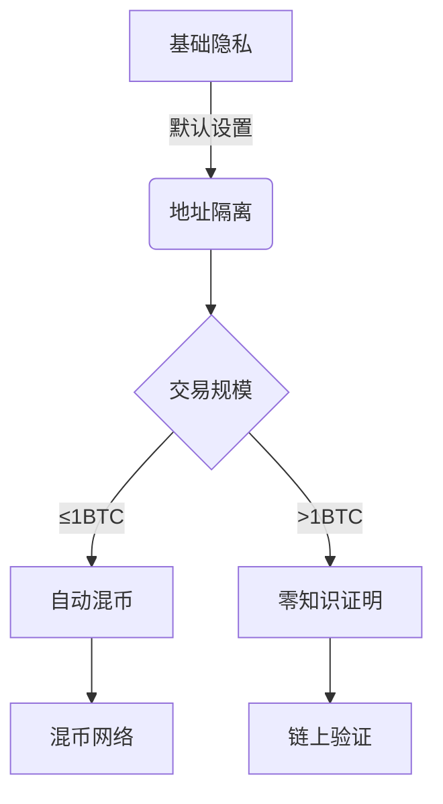

# 保护你的隐私：比特币使用中的隐私防护指南

比特币作为区块链技术的首个大规模应用，其透明性与隐私保护的平衡始终是用户关注的焦点。本文将从技术特性、操作规范和未来趋势三个维度，系统解析如何在享受去中心化金融优势的同时，构建多层次的隐私防护体系。

## 比特币隐私保护的底层逻辑

### 区块链透明性的双刃剑效应
比特币网络通过分布式账本实现了前所未有的交易透明度，但这种公开可追溯的特性也带来了隐私泄露风险。每个比特币地址的交易历史永久存储于区块链上，任何人均可通过区块浏览器查询任意地址的余额变动。这种设计虽然保障了系统的抗审查性，但也意味着一旦地址与现实身份产生关联，所有交易记录将永久暴露。

### 地址关联的蝴蝶效应
当用户重复使用同一地址进行收付款时，不同交易之间将形成可追踪的关联链。例如某电商商家若长期使用固定地址接收客户付款，攻击者可通过分析该地址的资金流动规律，推测出商户的营收规模、客户群体分布等敏感信息。更严重的是，若该地址曾与任何已知身份产生过资金往来，所有关联地址都将面临身份暴露风险。

## 构建隐私防护的操作规范

### 地址管理的黄金准则
**每次交易使用新地址**是比特币隐私保护的核心原则。现代钱包软件普遍支持地址自动生成功能，用户应充分利用这一特性。以个人财务为例，可按以下方式建立地址管理体系：
1. 收入账户：独立接收工资/投资收益
2. 支出账户：分设日常消费、大额采购等子类
3. 储蓄账户：冷钱包存储长期资产

这种隔离策略可有效防止交易图谱的关联扩展，即使某个地址信息泄露，也不会波及其他资金安全。

### 防御性交易策略
在进行大额转账时，建议采用"零散合并"策略：将资金分散到多个地址后再进行合并操作。例如转移10BTC资产时，可先将资金拆分为1BTC×10，间隔24小时后再分批合并，这种操作能显著增加交易追踪的难度。

## 网络层防护技术

### IP地址泄露的防范
比特币节点的P2P通信可能暴露用户的IP地址，建议采取以下防护措施：
1. **使用Tor网络**：通过洋葱路由技术实现IP地址的多层加密
2. **配置防火墙规则**：限制节点仅监听特定端口
3. **部署远程节点**：通过VPS建立中继节点进行交易广播

> 👉 [深入了解去中心化交易网络](https://bit.ly/okx_welcome)

### 混币服务的合理应用
混币服务通过多用户资金混合实现交易溯源阻断，其有效性取决于参与人数和混币轮次。以三用户混币为例：
| 用户 | 输入金额 | 输出金额 | 混币后地址 |
|------|----------|----------|------------|
| A    | 2BTC     | 2BTC     | A'         |
| B    | 5BTC     | 5BTC     | B'         |
| C    | 3BTC     | 3BTC     | C'         |

通过三次混合轮次后，资金流向的可追溯性将下降至初始状态的1/27。但需注意选择信誉良好的混币服务，避免资金风险。

## 钱包选择与隐私特性

### 隐私友好型钱包推荐
| 钱包类型   | 隐私特性                 | 适用场景           |
|------------|--------------------------|--------------------|
| Wasabi     | 零知识证明、混币集成     | 高级用户           |
| Electrum   | 自定义手续费、冷存储     | 日常使用           |
| Samourai   | 动态地址、远程节点       | 移动端高频交易     |

### 找零地址的优化实践
传统钱包在找零时可能暴露主地址信息，建议采用以下改进方案：
1. 自动生成独立找零地址
2. 定期清理找零资金
3. 设置找零金额阈值（如低于0.01BTC自动销毁）

## 未来隐私增强技术

### 零知识证明的应用
zk-SNARKs技术已在Zcash等隐私币中成功应用，其核心原理是通过数学证明验证交易有效性而不暴露任何细节。比特币社区正在研究将其集成到闪电网络中，未来可能实现：
- 隐藏交易金额
- 匿名通道建立
- 零知识路由验证

### 分层隐私保护架构
Bitcoin Core开发者正在设计多级隐私模式：

## 常见问题解答（FAQ）

### Q1：比特币交易是否完全匿名？
A：比特币采用假名机制，所有交易记录永久公开。用户需通过地址管理、混币服务等手段主动保护隐私，单纯依赖协议本身无法实现完全匿名。

### Q2：如何验证混币服务的可靠性？
A：可参考以下指标：
- 是否支持原子交换技术
- 运营团队是否通过独立审计
- 是否提供混币过程的数学证明
- 用户社区规模及活跃度

> 👉 [探索专业级数字资产管理方案](https://bit.ly/okx_welcome)

### Q3：使用Tor网络会影响交易速度吗？
A：Tor的三层加密会增加约200-500ms延迟，但可显著提升IP防护能力。建议结合远程节点方案，在保证安全的前提下优化体验。

### Q4：冷钱包能否完全防止隐私泄露？
A：冷钱包主要防范私钥泄露风险，但若曾用关联地址进行链上交易，仍可能通过交易图谱分析暴露资金流向。建议配合地址隔离策略使用。

### Q5：如何防范量子计算对隐私的威胁？
A：当前比特币使用的ECDSA算法对量子计算敏感，建议：
1. 优先使用P2PKH地址（相比P2SH更安全）
2. 定期转移资金至新生成的地址
3. 关注抗量子算法标准化进展

## 社交工程防护策略

在社交媒体展示比特币相关资产时，需特别注意：
1. 避免展示具体地址余额截图
2. 交易哈希值的分享需去除关联信息
3. 使用虚拟身份进行区块链交互

> 👉 [获取专业级安全防护指南](https://bit.ly/okx_welcome)

通过实施上述多层次防护策略，用户可以在享受比特币金融自由的同时，有效降低隐私泄露风险。随着技术的发展，未来的隐私保护方案将更加智能和易用，但现阶段的主动防护意识仍是保障资产安全的关键。