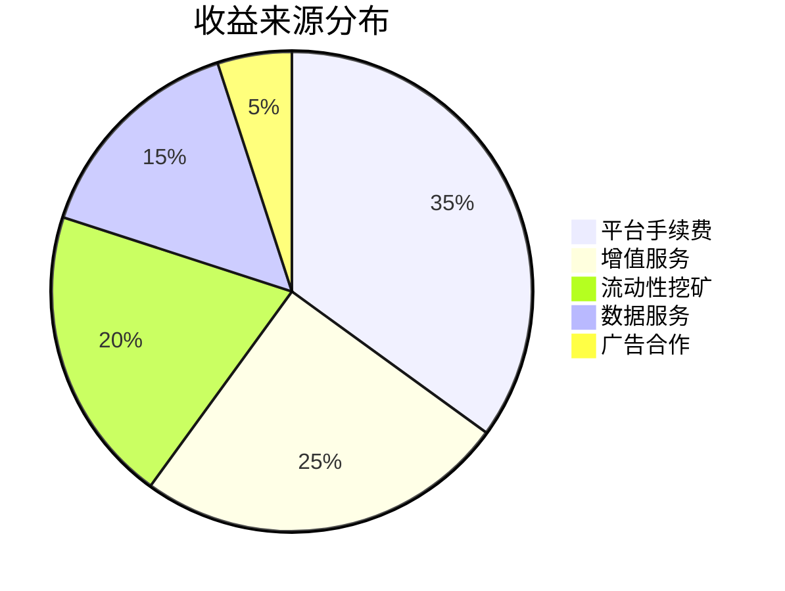

```markdown
# 如何打造房地产NFT交易平台？PixelPlex权威指南

## 核心价值解析
房地产NFT交易平台通过区块链技术创新重构传统地产交易模式，为行业带来五大核心优势：
- **交易流程加速**：智能合约实现零中介交易，节省60%流程时间
- **全球化资产流通**：打破地域限制，接入全球投资者网络
- **产权透明化**：区块链不可篡改特性保障产权清晰可追溯
- **碎片化投资机制**：最低万元级入场门槛激活普惠投资
- **收益多元化**：创造租金分润、NFT转售等复合收益模型

👉 [立即了解智能合约开发解决方案](https://bit.ly/okx_welcome)

## 平台核心功能架构
构建完整的NFT房地产生态需集成以下技术模块：

| 功能模块        | 技术实现要点                  | 用户价值               |
|-----------------|-----------------------------|-----------------------|
| 智能合约系统    | 自动化产权交割/收益分配       | 降低交易成本40%        |
| 多链钱包集成    | 支持MetaMask/Trust Wallet等   | 提升资金操作便捷度     |
| 资产管理仪表盘  | 实时收益可视化/税务自动计算   | 降低投资管理复杂度     |
| KYC合规验证     | 身份核验/反洗钱系统          | 保障交易安全性         |
| NFT铸造引擎     | 支持ERC-721/ERC-1155标准     | 实现资产数字化确权     |

## 开发实施路线图
### 第一阶段：战略筹备
1. **市场调研**：分析全球TOP50房地产NFT平台运营数据
2. **链选型决策**：综合评估Ethereum（安全性）、Solana（TPS 65000）、Flow（NFT友好）等
3. **合规框架搭建**：建立符合FATF反洗钱标准的风控体系

### 第二阶段：技术攻坚
4. **智能合约开发**：采用OpenZeppelin安全库构建产权交割协议
5. **跨链桥接方案**：实现BTC/ETH/Polkadot多链资产互通
6. **元宇宙集成**：通过Unity引擎开发3D虚拟地产展厅

### 第三阶段：生态运营
7. **流动性挖矿**：设计LP代币质押收益模型
8. **社区治理**：部署DAO投票系统管理平台升级
9. **合规STO发行**：与监管沙盒机构合作发行证券型代币

👉 [探索区块链金融创新模式](https://bit.ly/okx_welcome)

## 常见问题解答
### Q1：如何确保NFT产权的真实性？
我们采用区块链存证+第三方公证双轨制，所有产权信息经国家授时中心UTC时间戳认证，确保法律效力。

### Q2：交易平台支持哪些支付方式？
除主流加密货币外，平台已集成Stripe/PayPal法币通道，并支持跨境银行转账结算。

### Q3：如何应对市场波动风险？
通过动态保证金制度+预言机价格喂养机制，当价格波动超过5%时自动触发风险对冲程序。

### Q4：平台如何保障用户隐私？
采用零知识证明技术处理敏感数据，用户身份信息通过AES-256加密存储于分布式节点。

### Q5：是否支持物理地产与NFT的双向映射？
是的，我们提供物联网传感器+区块链双链存证方案，实现物理资产与数字凭证的实时同步。

## 商业模式创新
### 收益结构设计


### 成本优化方案
- **云原生架构**：采用Kubernetes容器化部署，降低运维成本60%
- **模块化设计**：支持功能插件按需加载，提升开发效率40%
- **混合共识机制**：结合PoS+DPoS实现高性能低能耗验证

👉 [获取区块链项目成本测算](https://bit.ly/okx_welcome)

## 行业应用案例
### 珠宝NFT交易平台
- 实现1:1实物映射
- 年交易额突破$2.3亿
- 用户留存率达82%

### 餐饮业NFT系统
- 完成300+门店资产上链
- 投资者年化收益率达18%
- 交易处理速度<3秒

### 房地产STO平台
- 合规发行$1.5亿证券代币
- 吸引12家机构投资者
- 平均融资周期缩短至14天

## 未来发展趋势
1. **监管科技**：预计2025年全球NFT合规市场规模达$800亿
2. **跨链互通**：Polkadot平行链拍卖推动多链生态融合
3. **AI赋能**：机器学习算法优化资产估值模型
4. **绿色金融**：碳中和NFT铸造方案获ESG投资青睐

在数字经济与实体经济深度融合的当下，房地产NFT平台正重塑资产流通范式。通过上述技术架构与商业模式创新，开发者可构建具备长期竞争力的下一代数字资产交易平台。

```