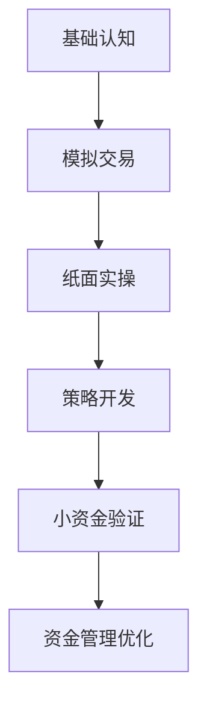

# 如何高效练习加密货币交易：从模拟到实战的完整指南

加密货币交易已成为全球投资者关注的焦点，但市场波动性和复杂性常令新手望而却步。本文将系统解析加密货币交易基础概念，提供5种零风险练习方法，并附赠7条进阶训练指南，帮助您在实战前构建完整的交易知识体系。

---

## 一、加密货币交易核心认知

### 1.1 交易机制解析
加密货币市场24/7全天候运作，交易标的包括主流币种（如BTC、ETH）及各类代币。影响价格的关键因素包含：
- **技术指标**：K线形态、移动平均线（MA）、相对强弱指数（RSI）
- **市场情绪**：监管政策、行业新闻、社交媒体热度
- **链上数据**：大额转账频率、矿工持仓变化

### 1.2 五大必知交易概念
| 概念        | 核心要点                          | 实战应用                      |
|-------------|-----------------------------------|-----------------------------|
| 市价单/限价单 | 即时成交 vs 指定价格触发         | 行情剧烈波动时优先使用限价单  |
| 波动率       | 价格变动幅度的量化指标             | 高波动率时段可尝试日内交易    |
| 流动性       | 资产快速变现能力                   | 交易冷门币种需预设流动性缓冲  |
| 技术分析     | 通过历史数据预测价格走势           | 结合成交量验证技术形态有效性  |
| 基本面分析   | 项目团队、应用场景、生态发展       | 长期持仓需重点关注项目进展    |

---

## 二、零风险交易训练体系

### 2.1 模拟交易平台
**优势特征**：
- 实时同步全球交易所数据
- 支持多币种组合配置
- 交易心理压力测试功能

👉 [体验专业加密货币交易](https://bit.ly/okx_welcome)  
*注：模拟平台建议选择支持跨市场交易策略验证的机构平台*

### 2.2 纸面交易实操
创建包含以下要素的训练日志：
```markdown
1. 交易日期与时间
2. 入场/出场点位
3. 仓位管理记录
4. 情绪波动标记
5. 复盘改进点
```

### 2.3 策略验证系统
构建多维测试矩阵：
| 测试维度   | 牛市环境 | 熊市环境 | 震荡行情 | 极端波动 |
|------------|----------|----------|----------|----------|
| 套利策略   | ★★☆      | ★★☆      | ★★★      | ★★☆      |
| 趋势交易   | ★★★      | ★★☆      | ★★☆      | ★★☆      |
| 网格交易   | ★★☆      | ★★★      | ★★★      | ★☆☆      |

---

## 三、实战进阶训练指南

### 3.1 风险管理框架
建立三层防护体系：
1. **资金管理**：单笔风险不超过总资金2%
2. **止损机制**：根据ATR指标动态调整止损位
3. **仓位调节**：金字塔加仓法 vs 矩阵分散法对比

### 3.2 交易心理建设
常见认知误区纠正：
- ❌ "这次回调是买入良机" → ✅ 建立量化入场标准
- ❌ "持有就是最好的策略" → ✅ 设定动态止盈线
- ❌ "跟着KOL操作" → ✅ 构建独立分析体系

---

## 四、常见问题解答（FAQ）

### Q1：模拟交易与真实交易存在哪些差异？
A：主要差异体现在心理压力层面。建议采用"心理压力测试模式"，在模拟账户中设置虚拟止损惩罚机制，逐步适应真实交易环境。

### Q2：每日需要投入多少时间进行练习？
A：新手建议每日2小时分段训练（早盘观察+午间策略调整+晚间复盘），进阶交易者可采用模块化训练法，每周重点突破特定技能。

### Q3：如何验证交易策略有效性？
A：建立包含三个不同市场周期的回测系统，重点关注策略在极端行情中的表现稳定性。可参考夏普比率等风险调整指标进行评估。

---

## 五、专业训练路径规划

### 5.1 阶段化成长路线


### 5.2 数据驱动优化
定期生成交易分析报告包含：
- 胜率与盈亏比平衡分析
- 不同币种表现对比
- 交易时段效率评估
- 策略相关性矩阵

👉 [获取专业交易分析工具](https://bit.ly/okx_welcome)  

---

通过系统化的模拟训练与实战推演，您将逐步建立完整的交易认知体系。记住：成功的交易者不是预测市场最准的人，而是风险控制最到位的实践者。立即开启您的加密货币交易训练之旅，让每一次实盘操作都建立在充分准备的基础之上。